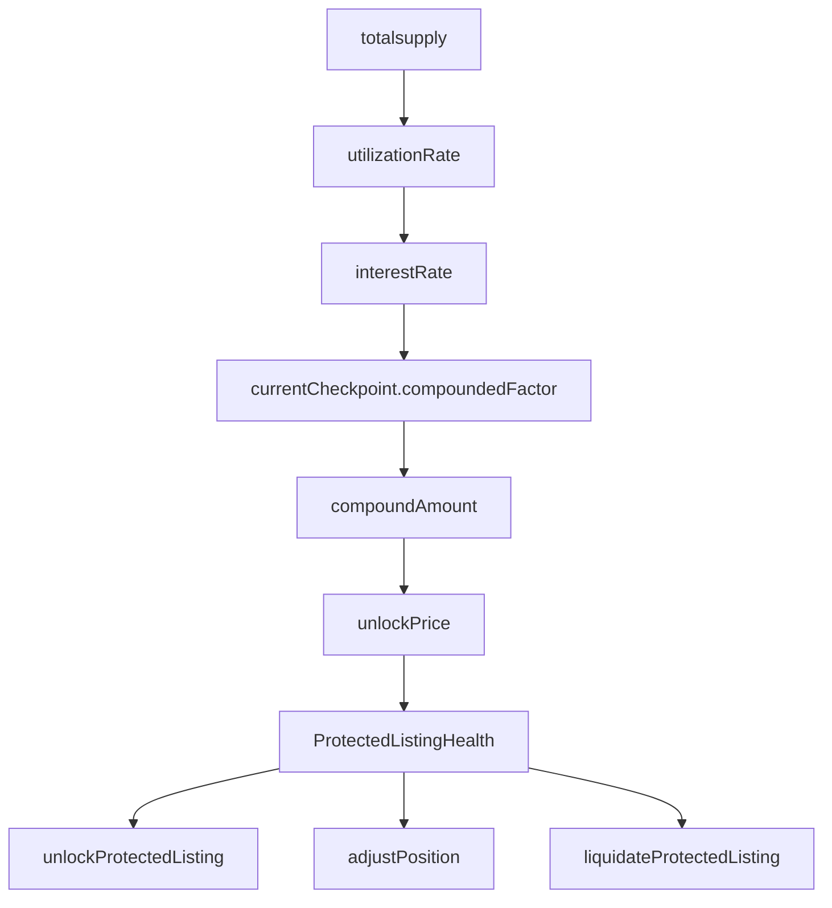

## Summary

| ID                                                                                                                                      | Title                                                                                                              |
| :-------------------------------------------------------------------------------------------------------------------------------------- | :----------------------------------------------------------------------------------------------------------------- |
| [H-01](2024-08-flayer.md#h-01-user-initializing-a-pool-will-have-his-funds-stuck)                                                       | User Initializing a Pool will have his funds stuck                                                                 |
| [H-02](2024-08-flayer.md#h-02-listingsreservedoesnt-delete-reserved-listings-causing-integration-issue)                                 | `Listings::reserve()` doesn't delete reserved listings causing integration issue                                   |
| [H-03](2024-08-flayer.md#h-03-voters-lose-their-tokens-due-to-misconfiguration-incancelfunction)                                        | Voters lose their tokens due to misconfiguration in `cancel` functioN                                              |
| [H-04](2024-08-flayer.md#h-04-owner-of-bridged-erc1155-royalties-cant-claim-them)                                                       | Owner of Bridged ERC1155 Royalties can't claim them                                                                |
| [H-05](2024-08-flayer.md#h-05-relisting-previously-liquidated-nft-will-cause-loss-of-funds-to-new-owner)                                | relisting previously liquidated NFT will cause loss of funds to new owner                                          |
| [H-06](2024-08-flayer.md#h-06-malicious-whale-can-cause-loss-of-fees-of-lp-providers)                                                   | Malicious Whale can cause Loss of Fees of LP Providers                                                             |
| [H-07](2024-08-flayer.md#h-07-attacker-can-frontrun-large-fee-deposits-fromfilllisting)                                                 | Attacker can frontrun large fee deposits from `fillListing`                                                        |
| [H-08](2024-08-flayer.md#h-08-reserving-a-previously-liquidated-token-will-cause-loss-of-funds-to-new-owner)                            | reserving a previously liquidated Token will cause loss of funds to new owner                                      |
| [M-01](2024-08-flayer.md#m-01-malicious-user-can-bypass-execution-ofcollectionshutdownfunction)                                         | Malicious user can bypass execution of `CollectionShutdown` function                                               |
| [M-02](2024-08-flayer.md#m-02-user-extra-funds-during-pool-initializtion-would-be-stuck-inuniswapimplementation)                        | User extra funds during Pool initializtion would be stuck in `UniswapImplementation`                               |
| [M-03](2024-08-flayer.md#m-03-broken-core-contract-functionalityuniswapimplementationsetfeeexemptionmakingexemptionfeeis-never-useable) | Broken core contract functionality `UniswapImplementation::setFeeExemption` making `exemptionFee` is never useable |
| [M-04](2024-08-flayer.md#m-04-edgecase-incollectionshutdownleading-to-funds-being-stuck)                                                | EdgeCase in `CollectionShutdown` leading to funds being stuck.                                                     |
| [M-05](2024-08-flayer.md#m-05-malicious-user-can-preventlockermanagerfrom-executingcollectionshutdownfunction)                          | Malicious user can prevent `lockerManager` from executing `CollectionShutdown` function                            |
| [M-06](2024-08-flayer.md#m-06-malicious-whale-can-manipulatetotalsupplyto-liquidate-or-illiquidate-a-liqudiateable-listing)             | Malicious Whale can manipulate `totalsupply` to liquidate or illiquidate a liqudiateable listing                   |


## [H-01] User Initializing a Pool will have his funds stuck

### Summary

User calling `Locker::initializeCollection()` Will have his liquidity Stuck and can't withdraw them back, leading to loss of funds

### Root Cause

Initialized liquidity are owned to `UniswapImplementation` and not The user initializing the pool, leading to stuck funds since neither him or the Admin can withdraw them back

### Internal pre-conditions

_No response_

### External pre-conditions

_No response_

### Attack Path

Before the sequence of the bug, Firstly Users needs to call `Locker::createCollection()`  
That calls `UniswapImplementation::registerCollection()`

Now the bug is as follows

User calls `Locker::initializeCollection()` to activate the uniV4 Pool and trading

```solidity
File: Locker.sol
367:     function initializeCollection(address _collection, uint _eth, uint[] calldata _tokenIds, uint _tokenSlippage, uint160 _sqrtPriceX96) public virtual whenNotPaused collectionExists(_collection) {
368:         // Ensure the collection is not already initialised
369:         if (collectionInitialized[_collection]) revert CollectionAlreadyInitialized();
370: 
371:         // Ensure that the minimum threshold of collection tokens have been provided
372:         uint _tokenIdsLength = _tokenIds.length;
373:         if (_tokenIdsLength < MINIMUM_TOKEN_IDS) revert InsufficientTokenIds();
374: 
375:         // cache
376:         IBaseImplementation _implementation = implementation;
377:         IERC20 nativeToken = IERC20(_implementation.nativeToken());
378: 
379:         // Convert the tokens into ERC20's which will return at a rate of 1:1
380:         deposit(_collection, _tokenIds, address(_implementation));
381: 
382:         // Send the native ETH equivalent token into the implementation
383:         uint startBalance = nativeToken.balanceOf(address(this));
384:         nativeToken.transferFrom(msg.sender, address(_implementation), _eth);
385: 
386:         // Make our internal call to our implementation
387:         uint tokens = _tokenIdsLength * 1 ether * 10 ** _collectionToken[_collection].denomination();
388:         _implementation.initializeCollection(_collection, _eth, tokens, _tokenSlippage, _sqrtPriceX96);
389: 
390:         // Map our collection as initialized
391:         collectionInitialized[_collection] = true;
392:         emit CollectionInitialized(_collection, _implementation.getCollectionPoolKey(_collection), _tokenIds, _sqrtPriceX96, msg.sender);
393: 
394:         // Refund any unused relative token to the user
395:         nativeToken.transfer(
396:             msg.sender,
397:             startBalance - nativeToken.balanceOf(address(this))
398:         );
399:     }
```

The user need to deposit at least 10NFT to initialize the collection

In Line 380 Those tokens gets deposited with `UniswapImplementation` as the receiver of minted `collectionToken`

in Line 384 we transfer the nativeToken (ie.wETH) to `UniswapImplementation`

Now Both `CollectionToken` and `wETH` are in `UniswapImplementation` so that we are ready for the initialization in Line 388

The problem is that we we initialize the pool through `UniswapImplementation` calling `poolManager` is that the liquidity is now owned to `UniswapImplementation` and not the user

[Here](https://github.com/sherlock-audit/2024-08-flayer/blob/0ec252cf9ef0f3470191dcf8318f6835f5ef688c/flayer/src/contracts/implementation/UniswapImplementation.sol#L214) `UniswapImplementation::initializeCollection()` calls Pool manager

Then it obtains a lock [here](https://github.com/sherlock-audit/2024-08-flayer/blob/0ec252cf9ef0f3470191dcf8318f6835f5ef688c/flayer/src/contracts/implementation/UniswapImplementation.sol#L226-L239) with the specified liquidity params

This is uniV4 `poolManager` `unlock` function

```solidity
File: PoolManager.sol
105:     function unlock(bytes calldata data) external override returns (bytes memory result) {
106:         if (Lock.isUnlocked()) AlreadyUnlocked.selector.revertWith();
107: 
108:         Lock.unlock();
109: 
110:         // the caller does everything in this callback, including paying what they owe via calls to settle
111:         result = IUnlockCallback(msg.sender).unlockCallback(data); //@audit this calls our unlockCallback
112: 
113:         if (NonzeroDeltaCount.read() != 0) CurrencyNotSettled.selector.revertWith();
114:         Lock.lock();
115:     }
```

`unlockCallback` of `UniswapImplementation` will call `_unlockCallback` that call `poolManager::modifyLiquidity()` [Here](https://github.com/sherlock-audit/2024-08-flayer/blob/0ec252cf9ef0f3470191dcf8318f6835f5ef688c/flayer/src/contracts/implementation/UniswapImplementation.sol#L382-L391)

Now the problem is that the owner of the liquidity pushed will be `msg.sender` which is `UniswapImplementation` as seen here

```solidity
File: PoolManager.sol
150:     function modifyLiquidity(
151:         PoolKey memory key,
152:         IPoolManager.ModifyLiquidityParams memory params,
153:         bytes calldata hookData
154:     ) external onlyWhenUnlocked noDelegateCall returns (BalanceDelta callerDelta, BalanceDelta feesAccrued) {
155:         PoolId id = key.toId();
156:         Pool.State storage pool = _getPool(id);
157:         pool.checkPoolInitialized();
158: 
159:         key.hooks.beforeModifyLiquidity(key, params, hookData);
160: 
161:         BalanceDelta principalDelta;
162:         (principalDelta, feesAccrued) = pool.modifyLiquidity(
163:             Pool.ModifyLiquidityParams({
164:                 owner: msg.sender,
165:                 tickLower: params.tickLower,
166:                 tickUpper: params.tickUpper,
167:                 liquidityDelta: params.liquidityDelta.toInt128(),
168:                 tickSpacing: key.tickSpacing,
169:                 salt: params.salt
170:             })
171:         );
```

This way, user initializing the pool with liquidity can't withdraw them back neither the owner since there are no function in `UniswapImplementation` to do so

This will lead to inability to shutdown any collection too, since total supply of `collectionToken` has to be < 5

### Impact

Loss of liquidity associated with pool initialization

As a minor impact, not being able to shutdown dormant collections as long as it has a liquidity pool initialized

### PoC

_No response_

### Mitigation

_No response_

## [H-02] `Listings::reserve()` doesn't delete reserved listings causing integration issue

### Summary

`Listings::reserve()` doesn't delete the original `_listings` mapping of NFT token that was reserved causing it to be shown as listed when its actually a protected listings in `protectedListings` contract

### Root Cause

undeleted `_listings` mapping of NFT token after its reserved

### Internal pre-conditions

Token to be listed initially.

### External pre-conditions

Another user comes and reserve the listed token

### Attack Path

When user initially creates a listing [here](https://github.com/sherlock-audit/2024-08-flayer/blob/0ec252cf9ef0f3470191dcf8318f6835f5ef688c/flayer/src/contracts/Listings.sol#L130-L166) it gets mapped to `_listings` map in the following function

```solidity
File: Listings.sol
242:     function _mapListings(CreateListing calldata _createListing, uint _tokenIds) private returns (uint tokensReceived_) {
243:         // Loop through our tokens
244:         for (uint i; i < _tokenIds; ++i) {
245:             // Create our initial listing and update the timestamp of the listing creation to now
246:             _listings[_createListing.collection][_createListing.tokenIds[i]] = Listing({
247:                 owner: _createListing.listing.owner,
248:                 created: uint40(block.timestamp),
249:                 duration: _createListing.listing.duration,
250:                 floorMultiple: _createListing.listing.floorMultiple
251:             });
252:         }
253: 
254:         // Our user will always receive one ERC20 per ERC721
255:         tokensReceived_ = _tokenIds * 1 ether;
256:     }
```

Now a user see this NFT and wants to `reserve()` it [Here](https://github.com/sherlock-audit/2024-08-flayer/blob/0ec252cf9ef0f3470191dcf8318f6835f5ef688c/flayer/src/contracts/Listings.sol#L690-L759) that doesn't delete the old listing and creates protected listing

```solidity
File: Listings.sol
737:         uint[] memory tokenIds = new uint[](1);
738:         tokenIds[0] = _tokenId;
739:         IProtectedListings.CreateListing[] memory createProtectedListing = new IProtectedListings.CreateListing[](1);
740:         createProtectedListing[0] = IProtectedListings.CreateListing({
741:             collection: _collection,
742:             tokenIds: tokenIds,
743:             listing: IProtectedListings.ProtectedListing({
744:                 owner: payable(address(this)),
745:                 tokenTaken: uint96(1 ether - _collateral),
746:                 checkpoint: 0 // Set in the `createListings` call
747:             })
748:         });
749: 
750:         // Create our listing, receiving the ERC20 into this contract
751:         protectedListings.createListings(createProtectedListing);
```

Now The user can unlock his protected Listing [Here](https://github.com/sherlock-audit/2024-08-flayer/blob/0ec252cf9ef0f3470191dcf8318f6835f5ef688c/flayer/src/contracts/ProtectedListings.sol#L287-L329) and can have the NFT in his wallet, yet the `_listings` mapping in `Listings` contract still shows that NFT as listing

### Impact

Quoting this from the audit readMe

> ### Q: Should potential issues, like broken assumptions about function behavior, be reported if they could pose risks in future integrations, even if they might not be an issue in the context of the scope? If yes, can you elaborate on properties/invariants that should hold?
> 
> **Flayer**
> 
> Responses such as expected fees and tax calculations should be correct for external protocols to utilise. It is also important that each NFT has a correct status. Having tokens that aren’t held by Flayer listed as for sale, protected listings missing, etc. would be detrimental.

Now as described above There will be a listing that shown as a listing in `listings.sol` when its actually reserved in `protectedListings` contract Causing integration issue and contradicting the readMe

### PoC

_No response_

### Mitigation

Delete the listings in `reserve()` function

## [H-03] Voters lose their tokens due to misconfiguration in `cancel` function

### Summary

When a shutdown has passed the quorum and `canExecute` = true but we didn't call the `execute` function and got some liquidity now we want to cancel the shutdown process calling `cancel` function  
we Remove our execution flag `delete _collectionParams[_collection];` and users can't either get their tokens nor the equivalent.

### Root Cause

Missing implementation in `cancel` function to restore tokens for the voters.

### Internal pre-conditions

1. A user calls `start` to shut down the collection.
2. Collection reaches the criteria to be shut.
3. We added some liquidity and want to cancel the shutdown.

### External pre-conditions

_No response_

### Attack Path

1. A user calls `start` to shut down the collection.
2. Collection reaches the criteria to be shut.
3. we added some liquidity and want to cancel the shutdown.
4. `cancel` function would execute removing execution flag
5. There is no implementation in `cancel` to give back users their votes or their tokens.
6. Users can't call `reclaimVote` because `_collectionParams[_collection]` is deleted in `cancel`

### Impact

Loss of funds.

### PoC

1. A user calls `CollectionShutdown::start` to start a shutdown.

[CollectionShutdown.sol#L135-L151](https://github.com/sherlock-audit/2024-08-flayer/blob/0ec252cf9ef0f3470191dcf8318f6835f5ef688c/flayer/src/contracts/utils/CollectionShutdown.sol#L135-L151)

```solidity
File: CollectionShutdown.sol
135:     function start(address _collection) public whenNotPaused {
////code
143:         // Get the total number of tokens still in circulation, specifying a maximum number
144:         // of tokens that can be present in a "dormant" collection.
145:@>       params.collectionToken = locker.collectionToken(_collection);
```

2. To execute the shutdown we need to have enough votes so users get votes and give their tokens to the contract in `vote` function.

This function transfer user palance to the shutdown contract and give him a share of votes.

[CollectionShutdown.sol#L191-L204](https://github.com/sherlock-audit/2024-08-flayer/blob/0ec252cf9ef0f3470191dcf8318f6835f5ef688c/flayer/src/contracts/utils/CollectionShutdown.sol#L191-L204)

```solidity
File: CollectionShutdown.sol
191:     function _vote(address _collection, CollectionShutdownParams memory params) internal returns (CollectionShutdownParams memory) {
192:         // Take tokens from the user and hold them in this escrow contract
193:         uint userVotes = params.collectionToken.balanceOf(msg.sender);
194:         if (userVotes == 0) revert UserHoldsNoTokens();
195: 
196:         // Pull our tokens in from the user
197:@>       params.collectionToken.transferFrom(msg.sender, address(this), userVotes);
198: 
199:         // Register the amount of votes sent as a whole, and store them against the user
200:         params.shutdownVotes += uint96(userVotes);
201: 
202:         // Register the amount of votes for the collection against the user
203:         unchecked { shutdownVoters[_collection][msg.sender] += userVotes; };=
////code 
207:         // If we can execute, then we need to fire another event
208:         if (!params.canExecute && params.shutdownVotes >= params.quorumVotes) {
209:@>            params.canExecute = true;
```

Considering `params.canExecute=true`.

3. We have added some liquidity for the Collection and want to cancel the shutdown.

This function check if  
- `canExecute=true` to make sure we can execute

- We have enough total supply  
    Then it will remove the execution flag.

[CollectionShutdown.sol#L390-L403](https://github.com/sherlock-audit/2024-08-flayer/blob/0ec252cf9ef0f3470191dcf8318f6835f5ef688c/flayer/src/contracts/utils/CollectionShutdown.sol#L390-L403)

```solidity
File: CollectionShutdown.sol
390:     function cancel(address _collection) public whenNotPaused {
391:         // Ensure that the vote count has reached quorum
392:         CollectionShutdownParams memory params = _collectionParams[_collection];
393:@>       if (!params.canExecute) revert ShutdownNotReachedQuorum();
394: 
395:         // Check if the total supply has surpassed an amount of the initial required
396:         // total supply. This would indicate that a collection has grown since the
397:         // initial shutdown was triggered and could result in an unsuspected liquidation.
398:@>       if (params.collectionToken.totalSupply() <= MAX_SHUTDOWN_TOKENS * 10 ** locker.collectionToken(_collection).denomination()) {
399:             revert InsufficientTotalSupplyToCancel();
400:         }
401: 
402:         // Remove our execution flag
403:@>      delete _collectionParams[_collection];
404:        emit CollectionShutdownCancelled(_collection);
```

Deleting `_collectionParams[_collection]` makes the users unable to get back their tokens, since in Line 369 it will cause panic revert underflow.

We are no longer can't call `reclaimVote` which should give users their tokens back.

[CollectionShutdown.sol#L356-L374](https://github.com/sherlock-audit/2024-08-flayer/blob/0ec252cf9ef0f3470191dcf8318f6835f5ef688c/flayer/src/contracts/utils/CollectionShutdown.sol#L356-L374)

```solidity
File: CollectionShutdown.sol
356:     function reclaimVote(address _collection) public whenNotPaused {
357:         // If the quorum has passed, then we can no longer reclaim as we are pending
358:         // an execution.
359:@>       CollectionShutdownParams storage params = _collectionParams[_collection];
360:         if (params.canExecute) revert ShutdownQuorumHasPassed();
361: 
362:         // Get the amount of votes that the user has cast for this collection
363:         uint userVotes = shutdownVoters[_collection][msg.sender];
364: 
365:         // If the user has not cast a vote, then we can revert early
366:         if (userVotes == 0) revert NoVotesPlacedYet();
367: 
368:         // We delete the votes that the user has attributed to the collection
369:         params.shutdownVotes -= uint96(userVotes);
370:         delete shutdownVoters[_collection][msg.sender];
371: 
372:         // We can now return their tokens
373:@>       params.collectionToken.transfer(msg.sender, userVotes);
```

And for sure can't call `claim` because no execution of shutdown happened.

Users funds stucked forever in this contract.

### Mitigation

Add proper implementation in `cancel` to resend tokens back to the voters.

## [H-04] Owner of Bridged ERC1155 Royalties can't claim them

### Summary

ERC1155 having royalties won't be claimed on bridged ERC1155 Tokens

### Root Cause

```solidity
File: InfernalRiftBelow.sol
220:     function claimRoyalties(address _collectionAddress, address _recipient, address[] calldata _tokens) public {
221:         // Ensure that our message is sent from the L1 domain messenger
222:         if (ICrossDomainMessenger(msg.sender).xDomainMessageSender() != INFERNAL_RIFT_ABOVE) {
223:             revert CrossChainSenderIsNotRiftAbove();
224:         }
225: 
226:         // Get our L2 address from the L1
227:         if (!isDeployedOnL2(_collectionAddress, false)) revert L1CollectionDoesNotExist();
228: 
229:         // Call our ERC721Bridgable contract as the owner to claim royalties to the recipient
230:         ERC721Bridgable(l2AddressForL1Collection(_collectionAddress, false)).claimRoyalties(_recipient, _tokens);
231:         emit RoyaltyClaimFinalized(_collectionAddress, _recipient, _tokens);
232:     }
```

In line 227 we check if the collection is deployed on L2 for ERC721 only (by the false parameter passed)

So if the call was for ERC1155 royalties it will revert in 227

```solidity
File: InfernalRiftBelow.sol
92:     function isDeployedOnL2(address _l1CollectionAddress, bool _is1155) public view returns (bool isDeployed_) {
93:         isDeployed_ = l2AddressForL1Collection(_l1CollectionAddress, _is1155).code.length > 0; //@audit we call it here with `_is1155` as false
94:     }
```

But this will return false cause `code.length` will be < 0

Because:  
in `l2AddressForL1Collection` we get the ERC721 implementation contract deployed with the ERC1155 l1 address bytes as salt

```solidity
File: InfernalRiftBelow.sol
77:     function l2AddressForL1Collection(address _l1CollectionAddress, bool _is1155) public view returns (address l2CollectionAddress_) {
78:         l2CollectionAddress_ = Clones.predictDeterministicAddress(
79:             _is1155 ? ERC1155_BRIDGABLE_IMPLEMENTATION : ERC721_BRIDGABLE_IMPLEMENTATION,
80:             bytes32(bytes20(_l1CollectionAddress))
81:         );
82:     }
```

But it will return an address that is not deployed and has 0 code length since we called `Clones.predictDeterministicAddress` With `ERC721_BRIDGABLE_IMPLEMENTATION` and `_l1CollectionAddress` which in our case is ERC1155

### Internal pre-conditions

_No response_

### External pre-conditions

ERC1155 tokens bridged are having pending royalties waiting to be claimed

### Attack Path

1. User bridge ERC1155 from L1 that supports royalties and royalties will be recorded in the `package` [Here](https://github.com/sherlock-audit/2024-08-flayer/blob/0ec252cf9ef0f3470191dcf8318f6835f5ef688c/moongate/src/InfernalRiftAbove.sol#L178)
2. L2 contract deploy the `ERC1155Bridgable` that supports claiming royalities and set him self as the royalty owner
3. Tokens bridged accumulate royalties waiting to be claimed
4. royalty owner try to claim them from L1 contract and txn go throw
5. Txn in L2 will revert due the wrong check [here](https://github.com/sherlock-audit/2024-08-flayer/blob/0ec252cf9ef0f3470191dcf8318f6835f5ef688c/moongate/src/InfernalRiftBelow.sol#L227) and there is no other function for claiming ERC1155 royalty

> **_Note!:_** According to token integration Question in the audit readMe
> 
> > ERC721 and ERC1155 tokens will be supported. Additionally, the subset of those tokens that implement ERC-2981 for royalties will gain additional support for claiming.

So in addition to the impact its clearly violating the readMe

### Impact

Loss of funds (royalties) on L2 ERC1155 Tokens

### PoC

_No response_

### Mitigation

Implement a check for ERC1155 deployed or build a logic from 0 to have seperate `claimRoyalty` functions for every token type on both contracts

## [H-05] relisting previously liquidated NFT will cause loss of funds to new owner

### Summary

Users calling `Listings::relist()` to NFT id that was previously listed as liquidation will have loss of funds when a second user buy it from them through `fillListings()`

### Root Cause

- When user call `relist()` we don't check if the original listing was liquidation so that we delete the mapping `_isLiquidation`
- Now it belongs to the new owner that is not liquidated and have paid the discrepancy in price and fees calculated according to duration and price
- when the new listing gets filled before the full duration passes through `fillListing()` it won't refund fees that was paid for duration not spent

### Internal pre-conditions

- There is a liquidated NFT that the user wants to relist

### External pre-conditions

The relisted NFT gets filled before full duration spent

### Attack Path

When an NFT token is liquidated from `protectedListings` its flagged as liquidation [here](https://github.com/sherlock-audit/2024-08-flayer/blob/0ec252cf9ef0f3470191dcf8318f6835f5ef688c/flayer/src/contracts/Listings.sol#L195) the liquidation is from user A

Now there can be a user (user B) where he sees that token and want to relist it at higher Price through `relist()`  
[Here](https://github.com/sherlock-audit/2024-08-flayer/blob/0ec252cf9ef0f3470191dcf8318f6835f5ef688c/flayer/src/contracts/Listings.sol#L625-L672)

The new user (user B) will pay the required tax [here](https://github.com/sherlock-audit/2024-08-flayer/blob/0ec252cf9ef0f3470191dcf8318f6835f5ef688c/flayer/src/contracts/Listings.sol#L668) according to duration and floor

The problem is that the NFT is not removed from liquidation flag

Now when another user (user C) sees that listing and want to fill it through `fillListings()` that calls `_fillListings`  
and the full duration of listing hasn't passed and user B still can and should get some fees refunded if user C fill it

there will be checks if the token is liquidation (in which our token is still flagged as liquidation although its not) [Here](https://github.com/sherlock-audit/2024-08-flayer/blob/0ec252cf9ef0f3470191dcf8318f6835f5ef688c/flayer/src/contracts/Listings.sol#L499-L519)

This check will prevent user B from getting refunded the unused Fees, causing loss of funds

### Impact

Loss of fees that should have been refunded (loss of funds)

### PoC

_No response_

### Mitigation

delete liquidated mapping after its filled

## [H-06] Malicious Whale can cause Loss of Fees of LP Providers

### Summary

When `BeforeSwap()` hook gets called it retrieves the current price of the Pair by `slot0` which is manipulatable by attacker so that the pool do the swap of the fees at very unfavorable price causing loss of funds to them and giving more favorable price to the attacker.

### Root Cause

Retrieval of `sqrtPriceX96` in `beforeSwap()` Hook via `getSlot0` which is manipulatable

### Internal pre-conditions

The collection Pool has the minimum initialized Liquidity (10 fNFT Tokens), or less if collection initializer withdrawn any to make the attack more feasible

ammFee is not set to make the attack more profitable, but not dependant on it

### External pre-conditions

Whale Malicious Actor Having High number of NFTs of that collection

### Attack Path

1. Malicious whale makes 1K fNFT Tokens swap in the direction of (1 for 0 which doesn't trigger `beforeSwap()` Hook [Here](https://github.com/sherlock-audit/2024-08-flayer/blob/0ec252cf9ef0f3470191dcf8318f6835f5ef688c/flayer/src/contracts/implementation/UniswapImplementation.sol#L501-L502)) that moves the price of fNFT token very low compared to `wETH`
2. That malicious whale makes a swap in the direction of 0 for 1 with
3. `beforeSwap` Hook logic gets triggered and the swap Delta amounts gets computed [here](https://github.com/sherlock-audit/2024-08-flayer/blob/0ec252cf9ef0f3470191dcf8318f6835f5ef688c/flayer/src/contracts/implementation/UniswapImplementation.sol#L534-L541) since the attacker chose to take what ever fees he can take by specifying `params.amountSpecified` to be < 0
4. Since price was retrieved here `(uint160 sqrtPriceX96,,,) = poolManager.getSlot0(poolId);` the price we are executing at is the manipulated very low fNFT-wETH making `ethIn` low amount and `tokenOut` as the whole Fees
5. The swap gets executed and the fees of that Pool are all sent to the that user in very low price
6. Then The malicious whale tries to revert the step one swap and the `beforeSwap` hook won't do any thing since the `pendingPoolFees.amount1` are all swapped already
7. Now That Whale has swapped the pool fees and provided very low `wETH` by sandwiching his txn, he can now dump those `collectionToken` on the Pool by selling them in the their real Price after he revert his step 1, this profits him and makes LP providers lose funds

### Impact

Loss of fees to that pool Liquidity Providers, forcing them to sell at my manipulated price

### Mitigation

use TWAP for fees swapping


## [H-07] Attacker can frontrun large fee deposits from `fillListing`


### Summary

Fees deposited and distributed to pools can be sandwiched causing loss of funds to real liquidity providers

### Root Cause

The way fees are distributed to uniswap pools is sandwich-able and the hook implementations decrease its probability but don't prevent it especially for bots monitoring the meme pool

### Internal pre-conditions

Large Fees are going to get deposited from `Listings::fillListings()`

### External pre-conditions

External normal user is swapping directly after the fees deposited in the direction that trigger fees swapping and distribution in `beforeSwap` Hook

### Attack Path

in `Listings::fillListings()` a user can fill multiple listing at a time

The listings is filled by looping through every id listed calling `_fillListing()`

in the internal `_fillListing()` the paid fee of the listing is built up through adding the fee to the transient storage [here](https://github.com/sherlock-audit/2024-08-flayer/blob/0ec252cf9ef0f3470191dcf8318f6835f5ef688c/flayer/src/contracts/Listings.sol#L508)

After the loop end we get the total amount of Fee here

```solidity
File: Listings.sol
595:         uint fillFee = _tload(FILL_FEE);
596:         if (fillFee != 0) {
597:             _collectionToken.approve(address(locker.implementation()), fillFee);
598:             locker.implementation().depositFees(collection, 0, fillFee);
599:             assembly { tstore(FILL_FEE, 0) }
600:         }
```

And we deposit it in Line 598 at one time.

Large listings filled that can have variable fees associated with it according to its time of listing

Attacker (bot) see this large sweep of a whale and sees it profitable

He front runs the trade and deposit liquidity to the uniswap pool, the `beforeAddLiquidity` gets triggered but he doesn't care about old fees, he is targeting new fees added by this large trade

Now the attacker is free to wait till `beforeSwap` gets triggered to swap the fee to `nativeToken` or it can be by coincidence that there is a swap coming in the pool in the direction that convert the `collectionToken` fee to `nativeToken`

Either way, generally large trades are sandwiched for profit

The steps can be as follows

1. Large `fillListings` is in meme pool
2. Attacker sees it profitable, now there is two scenarios
    1. He already has alot of floor NFTs and will deposit them in `Locker` to get alot of `collectionTokens` and deposit with them the `nativeToken` to the pool
    2. Or he doesn't already have NFTs for that collection then he can
        1. Buy alot of `collectionToken` from the uniswap Pool or sweep Multiple floor NFT and `deposit` them in the `locker` to get `collectionTokens`, what ever more profitable
        2. Deposit liquidity in the pool to sandwich the trade
        3. Remove the liquidity and convert all bough items back to His desired token
3. Now if there is no swaps already so that fees are converted to nativeTokens and distributed he can wait as liquidity provider or make a swap him self in the direction of swapping the fees and swap it back in the opposite direction after fees are distributed

> **_!Note_**: Steps above have alot of external conditions to show that there are multiple instances that this attack is feasible, but this doesn't mean that the attack isn't feasible in less constrained environment

### Impact

Real liquidity providers will lose large portion of fees provided

### PoC

_No response_

### Mitigation

Hook implementation really decreased the probability but didn't prevent it

It can be better to remove the distribution system and directly `donate()` them through a bot with Private Pool

If the above recommendation is not feasible, then Linear curve implementation can be used to slowly distribute fees what ever its size.


## [H-08] reserving a previously liquidated Token will cause loss of funds to new owner

### Summary

Users calling `Listings::reserve()` to NFT id that was previously listed as liquidation will have loss of funds when a second user buy it from them through `fillListings()`

### Root Cause

- When user call `reserve()` we don't check if the original listing was liquidation so that we delete the mapping `_isLiquidation`
    
- Now it belongs to the new owner that is not liquidated and have paid the fees calculated according to duration and price
    
- when the new listing gets filled before the full duration passes through `fillListing()` it won't refund fees that was paid for duration not spent
    

### Internal pre-conditions

There is a liquidated NFT that the user wants to `reserve()`

### External pre-conditions

The reserved NFT gets

listed again through `createListings()` and then gets filled though `fillListings()`

### Attack Path

When an NFT token is liquidated from `protectedListings` its flagged as liquidation [here](https://github.com/sherlock-audit/2024-08-flayer/blob/0ec252cf9ef0f3470191dcf8318f6835f5ef688c/flayer/src/contracts/Listings.sol#L195) the liquidation is from user A

Now there can be a user (user B) where he sees that token and want to it through [`reserve()`](https://github.com/sherlock-audit/2024-08-flayer/blob/0ec252cf9ef0f3470191dcf8318f6835f5ef688c/flayer/src/contracts/Listings.sol#L690) But the problem is that this function doesn't delete liquidation mapping after it checks it

Now user B unlock that token and list it through `createListings`

(user B) will pay the required tax [here](https://github.com/sherlock-audit/2024-08-flayer/blob/0ec252cf9ef0f3470191dcf8318f6835f5ef688c/flayer/src/contracts/Listings.sol#L149-L151) according to duration and floor by receiving less tokens from the floor as seen in the subtraction

The problem is that the NFT is not removed from liquidation flag

Now when another user (user C) sees that listing and want to fill it through `fillListings()` that calls `_fillListings`  
and the full duration of listing hasn't passed and user B still can and should get some fees refunded if user C fill it

there will be checks if the token is liquidation (in which our token is still flagged as liquidation although its not) [Here](https://github.com/sherlock-audit/2024-08-flayer/blob/0ec252cf9ef0f3470191dcf8318f6835f5ef688c/flayer/src/contracts/Listings.sol#L499-L519)

This check will prevent user B from getting refunded the unused Fees, causing loss of funds

### Impact

Loss of fees that should have been refunded (loss of funds)

### PoC

_No response_

### Mitigation

make `_isLiquidation` mapping to be per owner and not only the token Id


## [M-01] Malicious user can bypass execution of `CollectionShutdown` function

### Summary

Malicious user bypasses `CollectionShutdown::preventShutdown` by calling `CollectionShutdown::start` then `CollectionShutdown::reclaimVote` making the use of checks in `preventShutdown` useless.

### Root Cause

In `preventShutdown` function there a check to make sure there isn't currently a shutdown in progress.

[CollectionShutdown.sol#L420-L421](https://github.com/sherlock-audit/2024-08-flayer/blob/0ec252cf9ef0f3470191dcf8318f6835f5ef688c/flayer/src/contracts/utils/CollectionShutdown.sol#L420-L421)

```solidity
File: CollectionShutdown.sol
415:     function preventShutdown(address _collection, bool _prevent) public {
416:         // Make sure our user is a locker manager
417:         if (!locker.lockerManager().isManager(msg.sender)) revert ILocker.CallerIsNotManager();
418: 
419:         // Make sure that there isn't currently a shutdown in progress
420:@>       if (_collectionParams[_collection].shutdownVotes != 0) revert ShutdownProcessAlreadyStarted();
421: 
422:         // Update the shutdown to be prevented
423:         shutdownPrevented[_collection] = _prevent;
424:         emit CollectionShutdownPrevention(_collection, _prevent);
425:     }
```

This check doesn't confirm that the shutdown is in progress or not user can call `CollectionShutdown::start` to start a shutdown.  
Then `CollectionShutdown::reclaimVote` to set shutdownVotes back to 0.

Calling `start` function indeed increas the votes by calling `_vote`  
[CollectionShutdown.sol#L156-L157](https://github.com/sherlock-audit/2024-08-flayer/blob/0ec252cf9ef0f3470191dcf8318f6835f5ef688c/flayer/src/contracts/utils/CollectionShutdown.sol#L156-L157)

```solidity
File: CollectionShutdown.sol
135:     function start(address _collection) public whenNotPaused {
//code
155:         // Cast our vote from the user
156:@>       _collectionParams[_collection] = _vote(_collection, params);
```

In `_votes` the count of shotdowVotes increase which is normal  
[CollectionShutdown.sol#L200-L201](https://github.com/sherlock-audit/2024-08-flayer/blob/0ec252cf9ef0f3470191dcf8318f6835f5ef688c/flayer/src/contracts/utils/CollectionShutdown.sol#L200-L201)

```solidity
File: CollectionShutdown.sol
191:     function _vote(address _collection, CollectionShutdownParams memory params) internal returns (CollectionShutdownParams memory) {
//code
199:         // Register the amount of votes sent as a whole, and store them against the user
200:@>       params.shutdownVotes += uint96(userVotes);
```

There is no prevention for the use initiated the shutdown from calling `reclaimVote` .  
[CollectionShutdown.sol#L369-L370](https://github.com/sherlock-audit/2024-08-flayer/blob/0ec252cf9ef0f3470191dcf8318f6835f5ef688c/flayer/src/contracts/utils/CollectionShutdown.sol#L369-L370)

```solidity
File: CollectionShutdown.sol
356:     function reclaimVote(address _collection) public whenNotPaused {
//code
368:         // We delete the votes that the user has attributed to the collection
369:@>       params.shutdownVotes -= uint96(userVotes);
```

This line resets back the shutdownVotes to 0  
Making `CollectionShutdown::preventShutdown` checks useless.

### Internal pre-conditions

- `lockerManager` calling `CollectionShutdown::preventShutdown` .

### Attack Path 1

1. `lockerManager` calling CollectionShutdown::preventShutdown.
2. Malicious user front run the `CollectionShutdown::preventShutdown` by calling `CollectionShutdown::start` and `CollectionShutdown::reclaimVote` .
3. `lockerManger` believe this collection is prevented from shutdown but its not.

### Attack Path 2

1. Malicious user calling `CollectionShutdown::start` and `CollectionShutdown::reclaimVote` .
2. `lockerManager` calling CollectionShutdown::preventShutdown.
3. `lockerManger` believe this collection is prevented from shutdown but its not.

### Impact

Bypass `preventShutdown` function making it useless.

### Mitigation

- When doing a shutdown check for `quorumVotes` or check during `vote()` that the collection is prevented from shutdown.

Change the check in `preventShutdown`.

```diff
-         if (_collectionParams[_collection].shutdownVotes != 0) revert ShutdownProcessAlreadyStarted();
+         if (_collectionParams[_collection].quorumVotes != 0) revert ShutdownProcessAlreadyStarted();
```


## [M-02] User extra funds during Pool initializtion would be stuck in `UniswapImplementation`

### Summary

Locker contract interact with extra native tokens sent from user during pool initialisation in the wrong way leading to lost funds to user

### Root Cause

balance accounting of locker contract instead of implementation contract leading to funds loss to user

### Internal pre-conditions

_No response_

### External pre-conditions

User needs to calculate needed `nativeToken` using `_sqrtPriceX96` and amount `collectionToken` wrongly

Loss of funds depends on how much the pool won't take during initialization and will be stuck in the implementation (The extra sent funds)

### Attack Path

When user calls `Locker::initializeCollection()` with predetermined `_eth`

they get sent directly to `_implementation` [here](https://github.com/sherlock-audit/2024-08-flayer/blob/0ec252cf9ef0f3470191dcf8318f6835f5ef688c/flayer/src/contracts/Locker.sol#L384)

but as we see in `Locker::initializeCollection()`

```solidity
File: Locker.sol
367:     function initializeCollection(address _collection, uint _eth, uint[] calldata _tokenIds, uint _tokenSlippage, uint160 _sqrtPriceX96) public virtual whenNotPaused collectionExists(_collection) {
//////////////////////
378: 
379:         // Convert the tokens into ERC20's which will return at a rate of 1:1
380:         deposit(_collection, _tokenIds, address(_implementation));
381: 
382:         // Send the native ETH equivalent token into the implementation
383:         uint startBalance = nativeToken.balanceOf(address(this));//@audit it index the locker balance instead of implementation 
384:         nativeToken.transferFrom(msg.sender, address(_implementation), _eth);
385: 
386:         // Make our internal call to our implementation
387:         uint tokens = _tokenIdsLength * 1 ether * 10 ** _collectionToken[_collection].denomination();
388:         _implementation.initializeCollection(_collection, _eth, tokens, _tokenSlippage, _sqrtPriceX96);
389: 
390:         // Map our collection as initialized
391:         collectionInitialized[_collection] = true;
392:         emit CollectionInitialized(_collection, _implementation.getCollectionPoolKey(_collection), _tokenIds, _sqrtPriceX96, msg.sender);
393: 
394:         // Refund any unused relative token to the user
395:         nativeToken.transfer( //@audit this integration tries to send extraBalance sent from users back to him but it failes cause extraBalance is in UniswapImplementation.sol
396:             msg.sender,
397:             startBalance - nativeToken.balanceOf(address(this)) //@audit this substraction will always be 0 since this address balance never changed
398:         );
399:     }
```

Now here are the steps where the bug would arrise

1. User call `initializeCollection` with 20e18 `wETH` and 10NFT that its collection token has 0 `denomination` (10e18 `collectionToken`) `_sqrtPriceX96` of (for example 1 `Ratio`)
2. 20e18 `wETH` and 10e18 `collectionToken` is sent to `implementation`
3. in Line 388 `_implementation.initializeCollection` called that initialize the pool through `poolManager.initialize` and retrieves the needed liquidity [here](https://github.com/sherlock-audit/2024-08-flayer/blob/0ec252cf9ef0f3470191dcf8318f6835f5ef688c/flayer/src/contracts/implementation/UniswapImplementation.sol#L382) and deposit them [here](https://github.com/sherlock-audit/2024-08-flayer/blob/0ec252cf9ef0f3470191dcf8318f6835f5ef688c/flayer/src/contracts/implementation/UniswapImplementation.sol#L394-L401)
4. Now since the `_sqrtPriceX96` is of 1 Ratio then the tokens pushed [here](([https://github.com/sherlock-audit/2024-08-flayer/blob/0ec252cf9ef0f3470191dcf8318f6835f5ef688c/flayer/src/contracts/implementation/UniswapImplementation.sol#L394-L401](https://github.com/sherlock-audit/2024-08-flayer/blob/0ec252cf9ef0f3470191dcf8318f6835f5ef688c/flayer/src/contracts/implementation/UniswapImplementation.sol#L394-L401)) will be 10e18 of both tokens, any extra tokens won't be pushed (meaning they stay in the contract)

What would have been the right implementation is checking for `balanceOf(_implementation)` to make sure that all tokens user has deposited have gone into the pool and if not we do The line 396 Logic to pull extra tokens from `_implementation` (approvals will be needed for Locker contract)

> **_Note!:_**Those extra Tokens stuck at `_Implemenation` can be utilized by attacker providing less `_eth` than calculated intentionally during his pool initialization so that the user's stuck funds pay those needed `_eth`

### Impact

Loss of funds to user

wrong balance accounting of extra funds by Locker contract that if were don't right, the issue would have appeared

### PoC

_No response_

### Mitigation

```diff
    function initializeCollection(address _collection, uint _eth, uint[] calldata _tokenIds, uint _tokenSlippage, uint160 _sqrtPriceX96) public virtual whenNotPaused collectionExists(_collection) {
        // Ensure the collection is not already initialised
        if (collectionInitialized[_collection]) revert CollectionAlreadyInitialized();

        // Ensure that the minimum threshold of collection tokens have been provided
        uint _tokenIdsLength = _tokenIds.length;
        if (_tokenIdsLength < MINIMUM_TOKEN_IDS) revert InsufficientTokenIds();

        // cache
        IBaseImplementation _implementation = implementation;
        IERC20 nativeToken = IERC20(_implementation.nativeToken());

        // Convert the tokens into ERC20's which will return at a rate of 1:1
        deposit(_collection, _tokenIds, address(_implementation));

        // Send the native ETH equivalent token into the implementation
 -      uint startBalance = nativeToken.balanceOf(address(this));
+      uint startBalance = nativeToken.balanceOf(address(_implementation ));
        nativeToken.transferFrom(msg.sender, address(_implementation), _eth);

        // Make our internal call to our implementation
        uint tokens = _tokenIdsLength * 1 ether * 10 ** _collectionToken[_collection].denomination();
        _implementation.initializeCollection(_collection, _eth, tokens, _tokenSlippage, _sqrtPriceX96);

        // Map our collection as initialized
        collectionInitialized[_collection] = true;
        emit CollectionInitialized(_collection, _implementation.getCollectionPoolKey(_collection), _tokenIds, _sqrtPriceX96, msg.sender);

        // Refund any unused relative token to the user
-        nativeToken.transfer(
-            msg.sender,
-            startBalance - nativeToken.balanceOf(address(this))
+      nativeToken.transferFrom(_implementation, 
+      msg.sender, 
+      startBalance - nativeToken.balanceOf(address(_implementation))
        );
    }
```


## [M-03] Broken core contract functionality `UniswapImplementation::setFeeExemption` making `exemptionFee` is never useable

### Summary

In oreder to set a `FeeExemption` we assign a boolean flag to know if there is a exemptionfee or not  
but doing so with `0xFFFFFF` making `misinterpretation` and could override storage and fail to assign the fee  
which appears in

- `UniswapImplementation::setFeeExemption`
- `UniswapImplementation::removeFeeExemption`
- `UniswapImplementation::getFee`  
    making feeExemption never usable

### Root Cause

Using this check  
[UniswapImplementation.sol#L738-L739](https://github.com/sherlock-audit/2024-08-flayer/blob/0ec252cf9ef0f3470191dcf8318f6835f5ef688c/flayer/src/contracts/implementation/UniswapImplementation.sol#L738-L739)  
`feeOverrides[_beneficiary] = uint48(_flatFee) << 24 | 0xFFFFFF;`  
in `UniswapImplementation::setFeeExemption`

### Internal pre-conditions

_No response_

### External pre-conditions

_No response_

### Attack Path

Knowing how `feeOverrides[_beneficiary]` is setted in `UniswapImplementation::setFeeExemption`

`feeOverrides[_beneficiary] = uint48(_flatFee) << 24 | 0xFFFFFF; //@audit those bitwise manipulation seems wrong`  
with example `_flatfee` of 0

- uint48(_flatFee):
    - Binary: 000000000000000000000000000000000000000000000000 (48 bits of 0)
- uint48(_flatFee) << 24:
    - Binary: 000000000000000000000000000000000000000000000000 (unchanged, as we're shifting 0s)
- 0xFFFFFF:
    - Binary: 000000000000000000000000111111111111111111111111 (24 1's in the lower bits)
- Result of | operation:

```solidity
   000000000000000000000000000000000000000000000000
   |
   000000000000000000000000111111111111111111111111
   -----------------------------------------------
   000000000000000000000000111111111111111111111111
```

- Final result:
    - Binary: 000000000000000000000000111111111111111111111111
    - Hexadecimal: 0x00FFFFFF
    - Decimal: 16777215

in `getFee` the check will always be false

```solidity
File: UniswapImplementation.sol
698:     function getFee(PoolId _poolId, address _sender) public view returns (uint24 fee_) { 
////code
711:@>       if (uint24(swapFeeOverride & 0xFFFFFF) == 1) {
712:             // We can then extract the original uint24 fee override and apply this, only if
```

calculations

```solidity
   000000000000000000000000111111111111111111111111 (swapFeeOverride)
   &
   000000000000000000000000111111111111111111111111 (0xFFFFFF)
   -----------------------------------------------
   000000000000000000000000111111111111111111111111
```

- Result: 0xFFFFFF (16777215 in decimal)  
    which doesn't equal to 1.
    
- This is also applied to `UniswapImplementatoin::removeFeeExemption`
    

```solidity
File: UniswapImplementation.sol
749:     function removeFeeExemption(address _beneficiary) public onlyOwner {
750:         // Check that a beneficiary is currently enabled
751:@>       uint24 hasExemption = uint24(feeOverrides[_beneficiary] & 0xFFFFFF);
752:         if (hasExemption != 1) {
```

`exemptionFee` can't be used due to wrong bitwise operation.

### Impact

We can't set `exemptionFee`

### PoC

run these tests before and after the modificaion

- `UniswapImplementationTest::test_CanSetFeeExemption`
- `UniswapImplementationTest::test_CanGetFeeWithExemptFees`
- `UniswapImplementationTest::test_CanRemoveFeeExemption`

```solidity
    function test_CanSetFeeExemption(address _beneficiary, uint24 _validFee) public {
        // Ensure that the valid fee is.. well.. valid
        vm.assume(_validFee.isValid());

        // Confirm that the position does not yet exist
        (uint24 storedFee, bool enabled) = _decodeEnabledFee(uniswapImplementation.feeOverrides(_beneficiary));
        assertEq(storedFee, 0);
        assertEq(enabled, false);

        vm.expectEmit();
        emit UniswapImplementation.BeneficiaryFeeSet(_beneficiary, _validFee);
        uniswapImplementation.setFeeExemption(_beneficiary, _validFee);

        // Get our stored fee override
        uint48 feeOverride = uniswapImplementation.feeOverrides(_beneficiary);

        // Confirm the fee override is what we expect it to be
        assertEq(feeOverride, _encodeEnabledFee(_validFee, true));

        // Confirm that the decoded elements are correct
        (storedFee, enabled) = _decodeEnabledFee(feeOverride);
        assertEq(storedFee, _validFee);
        assertEq(enabled, true);
    }
```

### Mitigation

```diff
File: UniswapImplementation.sol
-738:         feeOverrides[_beneficiary] = uint48(_flatFee) << 24 | 0xFFFFFF;
+738:         feeOverrides[_beneficiary] = uint48(_flatFee) << 24 | 1; 
```

using 1 will not cuse problem and feeExemption will be used normally

If we used 1 instead of 0xFFFFFF  
in `setExemptionFee`

```solidity
   000000000000000000000000000000000000000000000000 (swapFeeOverride)
   |
   000000000000000000000000000000000000000000000001 (0xFFFFFF)
   -----------------------------------------------
   000000000000000000000000000000000000000000000001
```

This is the calculation of and operation in `getFee` and `removeFeeExemption`

```solidity
   000000000000000000000000000000000000000000000001 (swapFeeOverride)
   &
   000000000000000000000000111111111111111111111111 (0xFFFFFF)
   -----------------------------------------------
   000000000000000000000000000000000000000000000001
```

- Result: 0xFFFFFF (1 in decimal)  
    which equal to 1.


## [M-04] EdgeCase in `CollectionShutdown` leading to funds being stuck.

### Summary

EdgeCase in `CollectoinShutdown` make users funds stuck this happens when

1. shutdown started.
2. A user voted.
3. `quorumVotes` pass and wait for execution.
4. Execution revert due to active listing for the collection.
5. User can't call `reclaimVote` to get back tokens because `canExecute` is true.
6. `cancel` can't be called due to not passing the `MAX_SHUTDOWN_TOKENS`
7. if Malicious User has listed his token for 7 days this will cause DOS of funds availability of users on weekly basis repeating that behavior

### Root Cause

- in `CollectionShutdown::start` should have a check for listing to prevent such EdgeCase.

### Internal pre-conditions

1. A userA calls `CollectionShutdown::start` to start a shutdown.
2. A userB calls `CollectionShutdown::Vote` reaching those conditions :
    - `shutdownVotes` pass `quorumVotes`.
    - `canExecute` = true.
3. A Collection has listing.

### External pre-conditions

_No response_

### Attack Path

1. A user A calls `CollectionShutdown::start` to start a shutdown.  
    [CollectionShutdown.sol#L135-L136](https://github.com/sherlock-audit/2024-08-flayer/blob/0ec252cf9ef0f3470191dcf8318f6835f5ef688c/flayer/src/contracts/utils/CollectionShutdown.sol#L135-L136)
2. A user B calls `CollectionShutdown::Vote` reaching those conditions :
    - `shutdownVotes` pass `quorumVotes`.
    - `canExecute` = true.

[CollectionShutdown.sol#L208-L209](https://github.com/sherlock-audit/2024-08-flayer/blob/0ec252cf9ef0f3470191dcf8318f6835f5ef688c/flayer/src/contracts/utils/CollectionShutdown.sol#L208-L210)

```solidity
File: CollectionShutdown.sol
191:     function _vote(address _collection, CollectionShutdownParams memory params) internal returns (CollectionShutdownParams memory) {
//// code
208:         if (!params.canExecute && params.shutdownVotes >= params.quorumVotes) {
209:@>           params.canExecute = true;
```

After canExecute is true I should call execute function but  
3. `execute` function revert due to collection has listing.

[CollectionShutdown.sol#L240-L242](https://github.com/sherlock-audit/2024-08-flayer/blob/0ec252cf9ef0f3470191dcf8318f6835f5ef688c/flayer/src/contracts/utils/CollectionShutdown.sol#L240-L242)

```solidity
File: CollectionShutdown.sol
231:     function execute(address _collection, uint[] calldata _tokenIds) public onlyOwner whenNotPaused {
////code
240:         // Check that no listings currently exist
241:@>       if (_hasListings(_collection)) revert ListingsExist();
```

4. can't call `cancel` to cancel the execution due to not passing `MAX_SHUTDOWN_TOKENS`.

[CollectionShutdown.sol#L398-L399](https://github.com/sherlock-audit/2024-08-flayer/blob/0ec252cf9ef0f3470191dcf8318f6835f5ef688c/flayer/src/contracts/utils/CollectionShutdown.sol#L398-L399)

```solidity
File: CollectionShutdown.sol
390:     function cancel(address _collection) public whenNotPaused {
////code
398:         if (params.collectionToken.totalSupply() <= MAX_SHUTDOWN_TOKENS * 10 ** locker.collectionToken(_collection).denomination()) {
399:@>           revert InsufficientTotalSupplyToCancel();
```

5. can't call `reclaimVote` due to `canExecute`= true.  
    [CollectionShutdown.sol#L360-L361](https://github.com/sherlock-audit/2024-08-flayer/blob/0ec252cf9ef0f3470191dcf8318f6835f5ef688c/flayer/src/contracts/utils/CollectionShutdown.sol#L360-L361)

```solidity
File: CollectionShutdown.sol
356:     function reclaimVote(address _collection) public whenNotPaused {
////code
360:@>       if (params.canExecute) revert ShutdownQuorumHasPassed();
```

6. can't claim due to not executing the shutdown.  
    [CollectionShutdown.sol#L292-L293](https://github.com/sherlock-audit/2024-08-flayer/blob/0ec252cf9ef0f3470191dcf8318f6835f5ef688c/flayer/src/contracts/utils/CollectionShutdown.sol#L292-L293)

```solidity
File: CollectionShutdown.sol
285:     function claim(address _collection, address payable _claimant) public nonReentrant whenNotPaused {
////code
292:         if (params.sweeperPool == address(0)) revert ShutdownNotExecuted();
```

7. The tokens of user A and user B are stuck in the contract.

There is no other way for users to get their tokens or an equivalent value, as long as the attacker keeps listing his tokens on unfavorable price on weekly basis `duration`

### Impact

Loss of funds

### PoC

N/A

### Mitigation

- add a check for listing in `CollectionShutdown::start` so that we don't shutdown start with listings
- add check in Listings contract to prevent prolonging a listing or create new listing when that collection `canExecute = true`


## [M-05] Malicious user can prevent `lockerManager` from executing `CollectionShutdown` function

### Summary

Malicious user front run `CollectionShutdown::preventShutdown` by calling `CollectionShutdown::start` preventing preventShutdown execution.

### Root Cause

In-order to execute `preventShutdown` function checks that there isn't currently a shutdown in progress  
[CollectionShutdown.sol#L420](https://github.com/sherlock-audit/2024-08-flayer/blob/0ec252cf9ef0f3470191dcf8318f6835f5ef688c/flayer/src/contracts/utils/CollectionShutdown.sol#L420)

```solidity
File: CollectionShutdown.sol
415:     function preventShutdown(address _collection, bool _prevent) public {
416:         // Make sure our user is a locker manager
417:         if (!locker.lockerManager().isManager(msg.sender)) revert ILocker.CallerIsNotManager();
418: 
419:         // Make sure that there isn't currently a shutdown in progress
420:@>       if (_collectionParams[_collection].shutdownVotes != 0) revert ShutdownProcessAlreadyStarted();
421: 
422:         // Update the shutdown to be prevented
423:         shutdownPrevented[_collection] = _prevent;
424:         emit CollectionShutdownPrevention(_collection, _prevent);
425:     }

```

The idea to prevent this is to frontrun the `preventShutdowd` to change the condition and revert.

The `_collectionParams[_collection].shutdownVotes` is changed in `_vote` function that is called in `start` function

[CollectionShutdown.sol#L156](https://github.com/sherlock-audit/2024-08-flayer/blob/0ec252cf9ef0f3470191dcf8318f6835f5ef688c/flayer/src/contracts/utils/CollectionShutdown.sol#L156)

```solidity
File: CollectionShutdown.sol
135:     function start(address _collection) public whenNotPaused {
//snip
155:         // Cast our vote from the user
156:@>       _collectionParams[_collection] = _vote(_collection, params);
157:     }
158: 
```

Going to `_vote`  
[CollectionShutdown.sol#L200](https://github.com/sherlock-audit/2024-08-flayer/blob/0ec252cf9ef0f3470191dcf8318f6835f5ef688c/flayer/src/contracts/utils/CollectionShutdown.sol#L200)

```solidity
File: CollectionShutdown.sol
191:     function _vote(address _collection, CollectionShutdownParams memory params) internal returns (CollectionShutdownParams memory) {
//snip
200:@>       params.shutdownVotes += uint96(userVotes);
201: 
```

The choice to check if Shutdown has started is a mistake there should be implementation for reverting shutdown if its started.

### Internal pre-conditions

1. `lockerManager` calling `CollectionShutdown::preventShutdown`.

### Attack Path

- Malicious user is Watching the mempool waiting for `lockerManager` to call `CollectionShutdown::preventShutdown`.
- `lockerManager` call `CollectionShutdown::preventShutdown`.
- Malicious user front run the `CollectionShutdown::preventShutdown` by calling `CollectionShutdown::start` (can be 1 wei vote making the attack more feasible)
- `lockerManager` execution would revert.

Knowing this is a time sensitive function DOS due to the fact that this function will be used by the `lockerManager` to prevent shutdown of important NFT collection.

### Impact

DOS preventing `preventShutdown` function from getting executed.

### Mitigation

Consider Calling that function via a private meme Pool

Consider preventing minimum vote amount so that the attack becomes less feasible


## [M-06] Malicious Whale can manipulate `totalsupply` to liquidate or illiquidate a liqudiateable listing

  
### Summary

Inorder to liquidate a listing we check the `ProtectedListingHealth`,  
Manipulating `totalsupply` affect `ProtectedListingHealth` through multiple steps (explained bellow), making a whale liquidate illiquidateable listing and vice versa.

- Malicious whale can `deposit` and `redeem` affecting `ProtectedListingHealth` as it depends on `totalsupply` of the collection making:
    - `unlockPrice_` more than `0.95 ether` And making a list liquidatable and benefit from the `KEEPER_REWARD`.
- Or vice versa sandwiching `ProtectedListings::liquidateProtectedListing` calling `redeem` and `deposit` and hold liquidatable position.

### Root Cause

Utilizationrate is whale manipulatable.

Its feasible to the whale since `redeem` and `deposit` can be called in the same txn and no economical harm is applied to him during the attack

### Internal pre-conditions

_No response_

### External pre-conditions

Whale having high number of NFTs

### Attack Path

In `ProtecterdListings::liquidateProtectedListing` to liquidate a listing it first check the collateral  
[ProtectedListings.sol#L429-L433](https://github.com/sherlock-audit/2024-08-flayer/blob/0ec252cf9ef0f3470191dcf8318f6835f5ef688c/flayer/src/contracts/ProtectedListings.sol#L429-L433)

```solidity
File: ProtectedListings.sol
428:     function liquidateProtectedListing(address _collection, uint _tokenId) public lockerNotPaused listingExists(_collection, _tokenId) {
429:         // Ensure that the protected listing has run out of collateral
430:@>       int collateral = getProtectedListingHealth(_collection, _tokenId); //@audit bug, iam thinking about flashLoans attacks to make his health factor negative
431:@>       if (collateral >= 0) revert ListingStillHasCollateral(); 
```

`collateral` is (0.95 ether - `unlcokPrice`).  
[ProtectedListings.sol#L497-L501](https://github.com/sherlock-audit/2024-08-flayer/blob/0ec252cf9ef0f3470191dcf8318f6835f5ef688c/flayer/src/contracts/ProtectedListings.sol#L497-L501)

```solidity
File: ProtectedListings.sol
496:     function getProtectedListingHealth(address _collection, uint _tokenId) public view listingExists(_collection, _tokenId) returns (int) {
497:         // So we start at a whole token, minus: the keeper fee, the amount of tokens borrowed
498:         // and the amount of collateral based on the protected tax.
499:@>       return int(MAX_PROTECTED_TOKEN_AMOUNT) - int(unlockPrice(_collection, _tokenId));
500:     }
```

`unlcokPrice` calculated by `listing.checkpoint` and `currentCheckpoint`.  
[ProtectedListings.sol#L607-L617](https://github.com/sherlock-audit/2024-08-flayer/blob/0ec252cf9ef0f3470191dcf8318f6835f5ef688c/flayer/src/contracts/ProtectedListings.sol#L607-L617)

```solidity
File: ProtectedListings.sol
606:     function unlockPrice(address _collection, uint _tokenId) public view returns (uint unlockPrice_) {
////code
610:         // Calculate the final amount using the compounded factors and principle amount
611:@>       unlockPrice_ = locker.taxCalculator().compound({
612:             _principle: listing.tokenTaken,
613:             _initialCheckpoint: collectionCheckpoints[_collection][listing.checkpoint],
614:@>           _currentCheckpoint: _currentCheckpoint(_collection) 
615:         });
616:     }
```

Going to `TaxCalcutaor::compound`the `_currentCheckpoint.compoundedFactor` affected by the `compoundAmount_`.  
[TaxCalculator.sol#L106-L119](https://github.com/sherlock-audit/2024-08-flayer/blob/0ec252cf9ef0f3470191dcf8318f6835f5ef688c/flayer/src/contracts/TaxCalculator.sol#L106-L119)

```solidity
File: TaxCalculator.sol
106:     function compound(
//code
117:@>       uint compoundedFactor = _currentCheckpoint.compoundedFactor * 1e18 / _initialCheckpoint.compoundedFactor;
118:@>       compoundAmount_ = _principle * compoundedFactor / 1e18;
119:     }
```

Going back to `ProtectedListings::unlockPrice`the `_currentCheckpoint.compoundedFactor` is calculated in `ProtectedListings::_currentCheckpoint` and affected by `_utilizationRate`  
[ProtectedListings.sol#L580-L593](https://github.com/sherlock-audit/2024-08-flayer/blob/0ec252cf9ef0f3470191dcf8318f6835f5ef688c/flayer/src/contracts/ProtectedListings.sol#L580-L593)

```solidity
File: ProtectedListings.sol
579:     function _currentCheckpoint(address _collection) internal view returns (Checkpoint memory checkpoint_) {
580:         // Calculate the current interest rate based on utilization
581:@>       (, uint _utilizationRate) = utilizationRate(_collection);
////code
586:         // Save the new checkpoint
587:         checkpoint_ = Checkpoint({
588:@>           compoundedFactor: locker.taxCalculator().calculateCompoundedFactor({
589:                 _previousCompoundedFactor: previousCheckpoint.compoundedFactor,
590:                 _utilizationRate: _utilizationRate,
591:                 _timePeriod: block.timestamp - previousCheckpoint.timestamp
592:             }),
```

First going to `ProtectedListings::utilizationRate`:  
**The `totalsupply` affects `utilizatoinRate`**.  
[ProtectedListings.sol#L261-L274](https://github.com/sherlock-audit/2024-08-flayer/blob/0ec252cf9ef0f3470191dcf8318f6835f5ef688c/flayer/src/contracts/ProtectedListings.sol#L261-L274)

```solidity
File: ProtectedListings.sol
260:     function utilizationRate(address _collection) public view virtual returns (uint listingsOfType_, uint utilizationRate_) {
////code
269:             // If we have no totalSupply, then we have a zero percent utilization
270:             uint totalSupply = collectionToken.totalSupply();
271:             if (totalSupply != 0) {
272:@>               utilizationRate_ = (listingsOfType_ * 1e36 * 10 ** collectionToken.denomination()) / totalSupply;
273:             }
```

Back to `ProtectedListings::_currentCheckpoint` we get `compoundedFactor` from `taxCalculator::calculateCompoundedFactor`  
[TaxCalculator.sol#L80-L91](https://github.com/sherlock-audit/2024-08-flayer/blob/0ec252cf9ef0f3470191dcf8318f6835f5ef688c/flayer/src/contracts/TaxCalculator.sol#L80-L91)

```solidity
File: TaxCalculator.sol
80:     function calculateCompoundedFactor(uint _previousCompoundedFactor, uint _utilizationRate, uint _timePeriod) public view returns (uint compoundedFactor_) {
81:         // Get our interest rate from our utilization rate
82:@>       uint interestRate = this.calculateProtectedInterest(_utilizationRate);
83: 
84:         // Ensure we calculate the compounded factor with correct precision. `interestRate` is
85:         // in basis points per annum with 1e2 precision and we convert the annual rate to per
86:         // second rate.
87:         uint perSecondRate = (interestRate * 1e18) / (365 * 24 * 60 * 60);
88: 
89:         // Calculate new compounded factor
90:@>         compoundedFactor_ = _previousCompoundedFactor * (1e18 + (perSecondRate / 1000 * _timePeriod)) / 1e18;
91:     }
```

`interestRate` is affected by `_utilizationRate`  
[TaxCalculator.sol#L59-L70](https://github.com/sherlock-audit/2024-08-flayer/blob/0ec252cf9ef0f3470191dcf8318f6835f5ef688c/flayer/src/contracts/TaxCalculator.sol#L59-L70)

```solidity
File: TaxCalculator.sol
59:     function calculateProtectedInterest(uint _utilizationRate) public pure returns (uint interestRate_) {
60:         // If we haven't reached our kink, then we can just return the base fee
61:         if (_utilizationRate <= UTILIZATION_KINK) {
62:             // Calculate percentage increase for input range 0 to 0.8 ether (2% to 8%)
63:@>           interestRate_ = 200 + (_utilizationRate * 600) / UTILIZATION_KINK;
64:         }
65:         // If we have passed our kink value, then we need to calculate our additional fee
66:         else {
67:             // Convert value in the range 0.8 to 1 to the respective percentage between 8% and
68:             // 100% and make it accurate to 2 decimal places.
69:@>           interestRate_ = (((_utilizationRate - UTILIZATION_KINK) * (100 - 8)) / (1 ether - UTILIZATION_KINK) + 8) * 100;
70:         }
```

Looking at those series of affections with a simple flow chart:



As said `ProtectedListingHealth` is affected by `totalsupply` through all the steps above, A whale could manipulate `totalsupply` affecting the `ProtectedListingHealth` and :

- liquidate a liquid position by front running `ProtectedListings::liquidateProtectedListing` with instant `deposit` and `redeem` manipulation `totalsupply` affecting `collateral` needed in `ProtectedListings::liquidateProtectedListing` .
- liquidate an liquid position by instant `redeem` and `deposit` and benefit from the `KEEPER_REWARD`.

### Impact

liquidation is whale manipulable.

### PoC

- First getting the consts 
	- The initial compoundfactor in `Taxcalculator::compound` this value is calculated throw creating a new listing and depends on `utilizationrate` assuming initial values is
		- `listingsOfType_` = 20
		- `totalsupply` = 100e18 and `utilizationRate` = 200000000000000000
		- then the `_initialCheckpoint.compoundedFactor` = 1e18

- The `_currentCheckpoint.compoundedFactor` depends on `utilizationRate` and `previousCheckpoint.compoundedFactor` and `_timePeriod` its the value of thime passed since the last compound factor
	- These values should be as follow
		-  assume `_timePeriod` = 10000
		- `listingsOfType_` = 20
		- `totalsupply` = 100e18 and `utilizationRate` = 200000000000000000
		- `previousCheckpoint.compoundedFactor` = 1e18 from previous
	- As result from the values above `_currentCheckpoint.compoundedFactor` = 1000110984271940000

- Computing `compoundAmount` from `_initialCheckpoint.compoundedFactor` and `_currentCheckpoint.compoundedFactor` assuming user take `_principle: listing.tokenTaken` = 5e17
	- `unlockPrice_` = `compoundAmount` = 2e17
- The health `ProtectedListingHealth` then will equal to 449445078640300000


- Manipulating the total supply and recalculate the `_currentCheckpoint.compoundedFactor` with the new `utilizationrate` with the same data with previous example
	- Will decrease the `totalsupply` to 1e18
	- `_currentCheckpoint.compoundedFactor` = 1280314561136470000
	- `unlockPrice_` = `compoundAmount` = 1280314561136470000
	- `ProtectedListingHealth` = -951572805682350000
- The value is negative that its liquidable whale can now liquidate the user and take the `KEEPER_REWARD = 0.05 ether` .
- This could be vice versa and whale hold A negative value indicates that a listing can be liquidated and if any user try to liquidate him he manipulate the `utilizationRate` and hold the position.

- The same method could be applied in `ProtectedListings::adjustPosition` making whale take more dept than he should, or prevent another user from taking a dept he suppose to take.
- This is applied too in `ProtectedListings::unlockProtectedLisitngs` manipulating `collateral` and pay less fees than he must, or make another user pay alot more fees than he supposed to pay.
### Mitigation

One of the solutions is to prevent `deposit` and `redeem` in same txn, since if a user wants another NFT he can do `swap` without manipulating the supply

Make it less feasible to the whale to carry the attack
